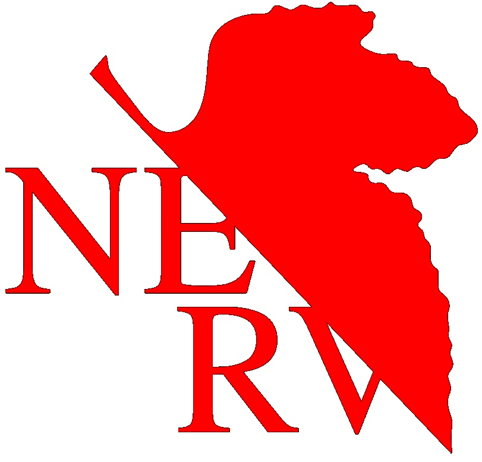
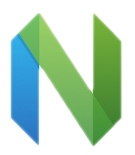

 

<i align="center">cold-soda-jay</i>

----

 

Hi there! I am Jay, a fan of [Python](https://www.python.org/)  
, [Neovim](https://neovim.io/)   and [Neon Genesis Evangelion](https://www.evangelion.co.jp/) !

<!---->
<!--https://img.shields.io/static/v1?label=%20&logo=python&message=%20&logoColor=orange&color=white   -->

Recent Projects

 

 

-----

Credits: [cold-soda-jay](https://github.com/cold-soda-jay)

Last Edited on: 12/03/2021
